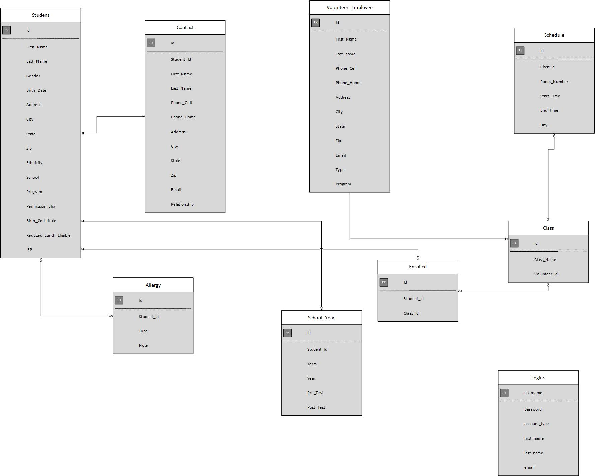

# Community Lifeline Ministries Project

## Background
Community Lifeline ministries (CLM) is a non-profit organization based in Joliet, Illinois. The organization was formed in September 2014. Since then they have been trying to improve the local community’s quality of life. They do so by hosting several outreach programs than aim to benefit children’s education, community health nourishment, and help stop the spread of violence. CLM has three main programs to date: GEMS after school program, Blessing table, and Sons of Thunder.  This project is for the GEMS after school program. GEMS stands for Growth Education and Motivation of Students. GEMS’s purpose is to provide a learning environment for under-represented youth within the community.  See their [website](http://www.sbcjoliet.org/gems.html) for more details.

## Project Overview
They are in need of a database and reporting system for tracking student demographics, attendance, test results, etc.

## Current Status
The project has been implemented with a MySQL database and PHP.  The [current version](http://cs.lewisu.edu/~mlewis/community-lifeline-ministries/index.html) is running on the Lewis Front server (ask me for credentials).  Many of the webpages will need to be rewritten to provide a more user-friendly search and usable reports.  Additional reports need to be added.  The database may require some modification.  Here's the current design:

